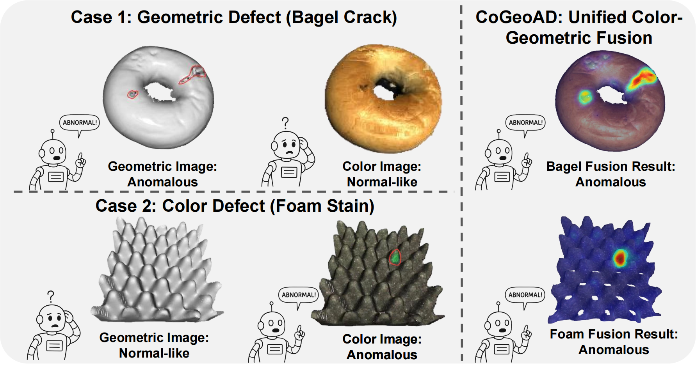
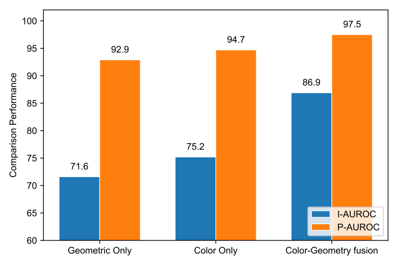
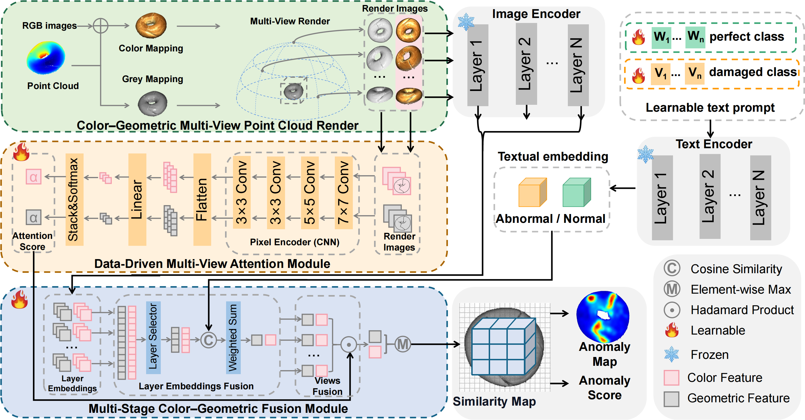

# CoGeoAD
CoGeoAD: Hierarchical Color-Geometric Fusion with Multi-View Attention for Zero-Shot 3D Anomaly Detection
## Introduction 
 Zero-shot 3D anomaly detection is essential for industrial quality inspection, where labeled anomaly samples are scarce. Meanwhile, existing methods lack an effective mechanism to fuse complementary 2D color cues with 3D geometric structures, limiting their ability to detect both surface and structural defects in a unified framework. To address these issues, we propose CoGeoAD, a unified zero-shot framework that bridges the 2D-3D domain gap by constructing pixel-aligned paired colored and geometric point clouds. The framework introduces a Data-Driven Multi-View Attention (MVA) mechanism to adaptively aggregate 3D features and a Multi-Stage Color-Geometric Fusion (MS-CGF) module to hierarchically integrate multi-scale features from both modalities. Extensive experiments on the MVTec3D-AD and Eyecandies benchmarks demonstrate that CoGeoAD achieves state-of-the-art performance, effectively capturing both structural and textural anomalies in complex industrial scenarios.
## Motivation
<p align="center">
  <a href="assets/motivation-1.png">
    
  </a>
  <a href="assets/motivation-2.png">
    
  </a>
</p>

## Overview of CoGeoAD
<p align="center">
  <a href="assets/overview.png">
    
  </a>
</p>

## How to Run

### Environment
To set up the environment, please follow these steps:
```bash
   conda create -n cogeoad python=3.8
   conda activate cogeoad
   pip install -r requirements.txt
```

### Prepare your dataset
We prepare the rendering datasets of MVTecAD-3D and Eyecandies below.

|Dataset|Original version|Rendering version|
|:---:|:---:|:---:|
|MVTec3D-AD|[Ori](https://huggingface.co/datasets/CoGeoAD/CoGeoAD-data/blob/main/MVTec3D.zip)|[Render](https://huggingface.co/datasets/CoGeoAD/CoGeoAD-data/blob/main/mvtec-re.zip)|
|Eyecandies|[Ori](https://huggingface.co/datasets/CoGeoAD/CoGeoAD-data/blob/main/Eyecandies.zip)|[Render](https://huggingface.co/datasets/CoGeoAD/CoGeoAD-data/blob/main/Eyecandies-re.zip)|

If you prefer to generate the data yourself, use the provided scripts:

```bash
python ./gen_data/render_mvtec.py --data_path your_data_path
python ./gen_data/render_eyecandies.py --data_path your_data_path
```
### Run CoGeoAD
To Train:
Set mode = 0, your dataset addness, and other parameters inside run_cross_dataset.py.

Run the script:
```bash
python run_cross_dataset.py
```
To Test:
Set mode = 1, your dataset addness, and other parameters inside run_cross_dataset.py.
Run the script:
```bash
python run_cross_dataset.py
```
